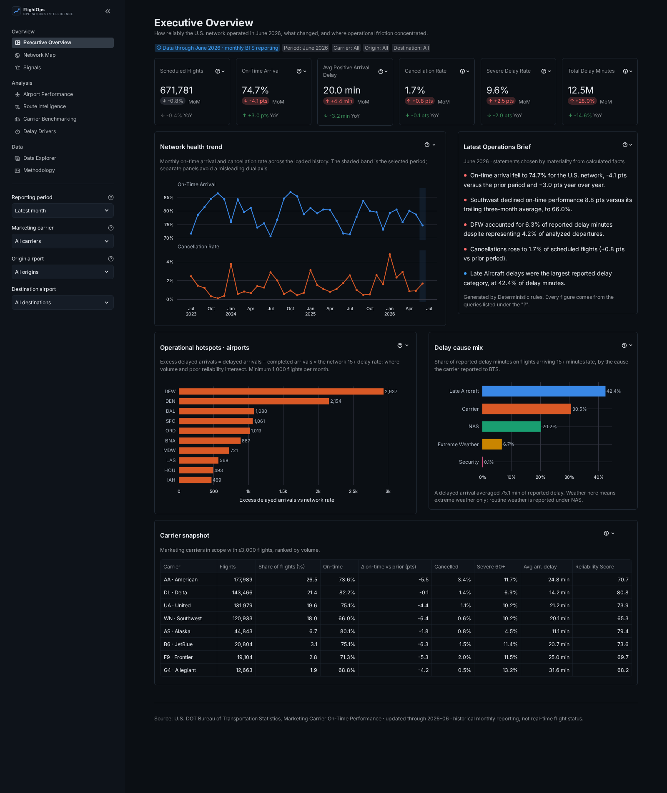
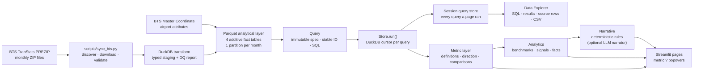
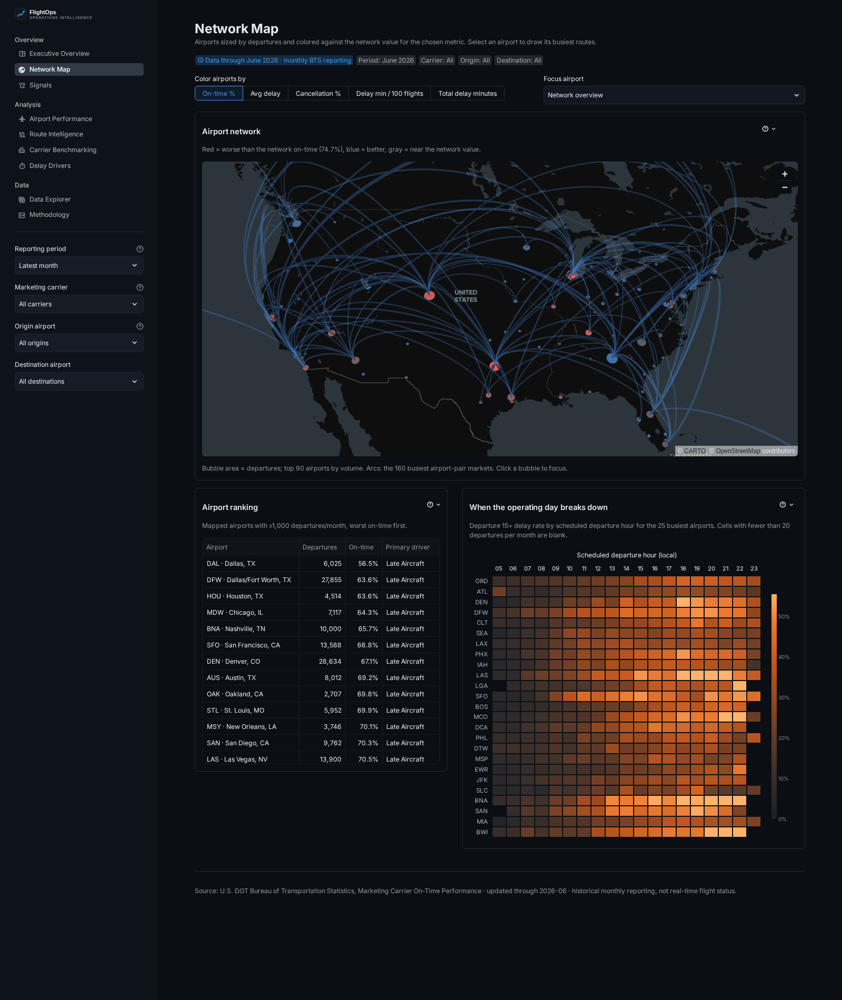
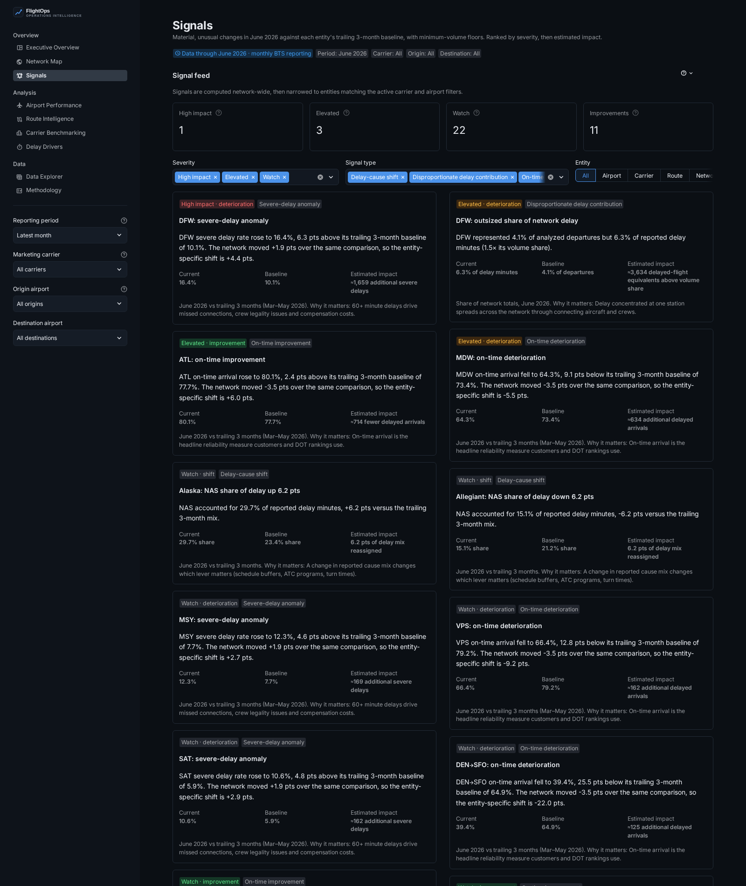
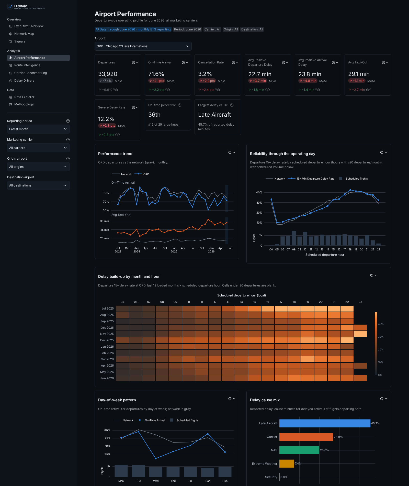
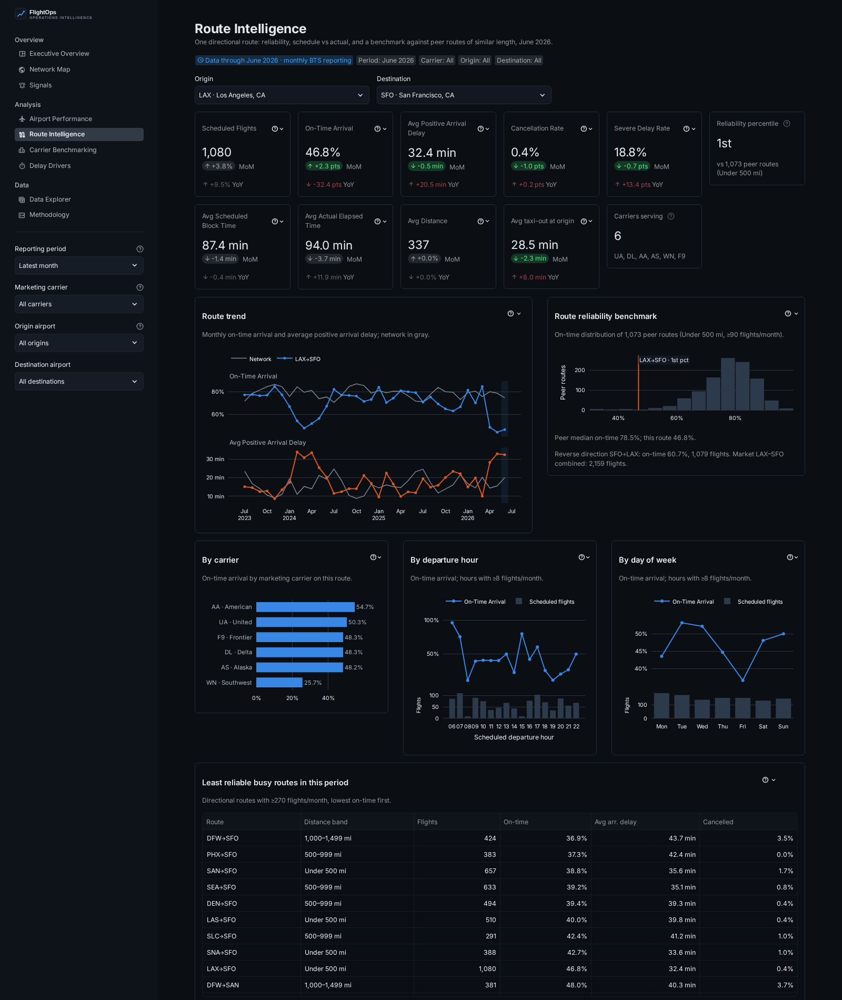
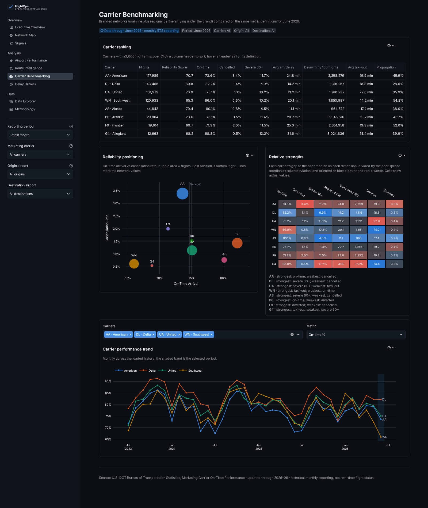
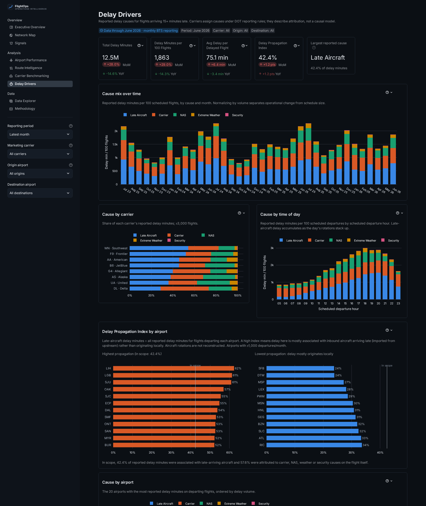
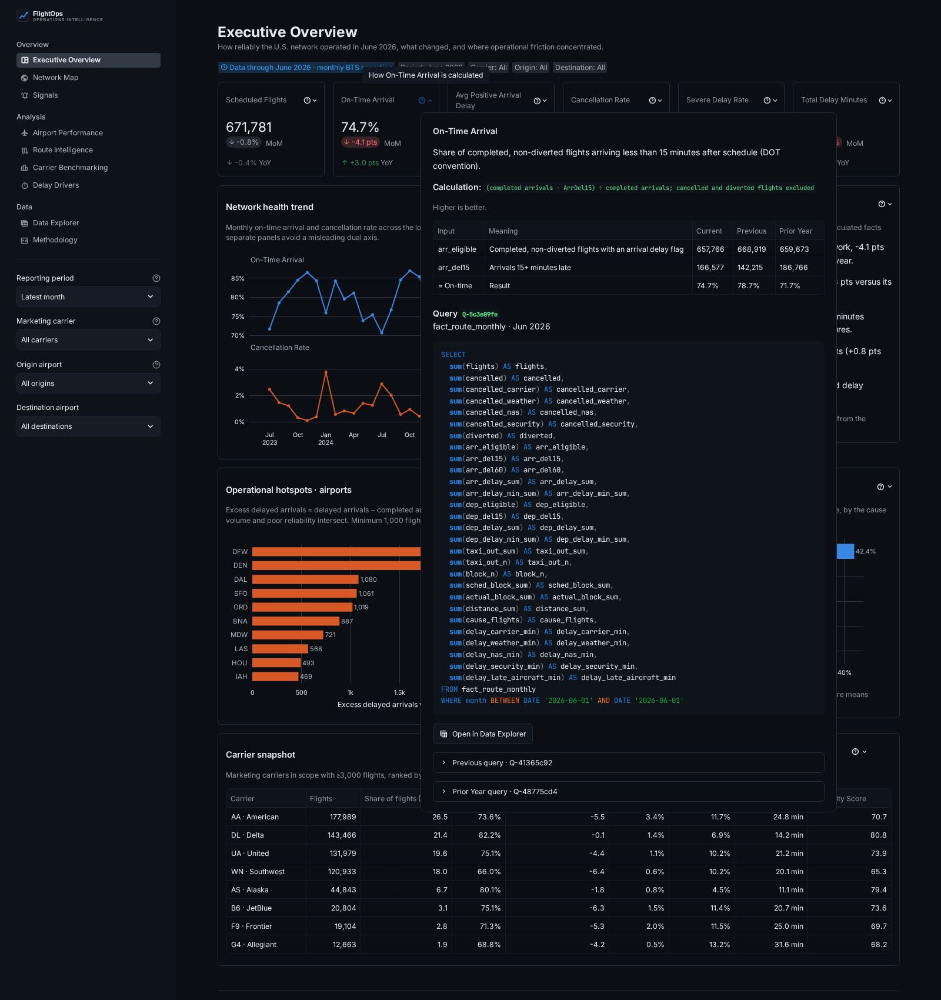
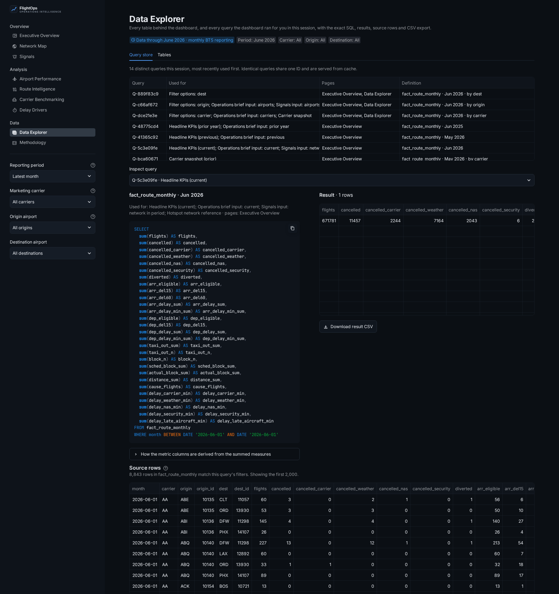

# FlightOps Intelligence

**U.S. airline operations and network performance, built on official DOT on-time data.**



## What it does

Airline operations teams need to know how the network ran, what changed and where the problems are concentrated. They
need numbers they can trust and defend. Public on-time data can answer those questions, but it arrives as roughly
650,000 raw rows a month across 120 columns, with reporting quirks that make naive analysis wrong.

FlightOps Intelligence turns 22.9 million U.S. flight records into an operational view of network reliability, airport
friction, route health, carrier benchmarking and delay propagation.

- **Governed metrics.** Every KPI has one definition, one direction (is up good or bad?) and one place in the code.
- **Traceable numbers.** Every aggregated figure has a **?** that shows its definition, the input measures and the exact
  SQL that produced it, with a link into the **Data Explorer**, where the result and the source rows can be inspected and
  exported to CSV.
- **Honest comparisons.** Rates move in percentage points, comparisons run against the prior period and the same period
  last year, and minimum-volume rules keep a 40-flight route from outranking a trunk route.
- **Signals instead of hunting.** A deterministic engine surfaces material, unusual changes and ranks them by estimated
  affected flights.
- **Visible lineage.** Source, coverage, data-quality checks and reconciliation are shown in the product itself.

The data is historical monthly reporting from the Bureau of Transportation Statistics, not live flight status. The app
shows the loaded coverage ("Data through June 2026") on every page and computes it from the data, never hard-coding it.

## Key capabilities

| Page | Question it answers |
|---|---|
| **Executive Overview** | How healthy was the network in the latest period, what changed, and where is the friction? Six KPI cards with prior-period and YoY deltas, a network health trend, a calculated *Latest Operations Brief*, airport hotspots, the delay-cause mix and a carrier snapshot. |
| **Network Map** | Where does friction sit geographically? Airports are sized by departures and colored against the network value, with route arcs for any selected airport and an **airport × departure-hour heatmap** showing where the operating day breaks down. |
| **Signals** | What changed that an operations executive should know about? Network-relative shifts in on-time, cancellation, severe-delay and taxi-out performance, delay concentration, cause-mix shifts and improvement streaks. Each signal states magnitude, baseline, comparison window, impact and why it matters. |
| **Airport Performance** | An operating profile: KPIs, a percentile against same-tier hubs, month × hour delay build-up, day-of-week pattern, cause mix, carriers, problem routes and best/worst destinations. |
| **Route Intelligence** | Directional route KPIs, block-time vs actual, performance by carrier, hour and day, and a **reliability percentile against a documented peer group** (same distance band, minimum volume). |
| **Carrier Benchmarking** | A sortable ranking, a reliability-vs-cancellation positioning chart, multi-carrier trends and a *relative strengths* matrix oriented so that blue always means better. |
| **Delay Drivers** | Reported cause mix over time, by carrier, by airport and by time of day, plus the **Delay Propagation Index**: how much of each station's delay is associated with late-arriving aircraft. |
| **Data Explorer** | Where did this number come from? The *query store* lists every query the dashboard ran in your session, with its SQL, result, the stored rows it summed and CSV export. The *Tables* tab browses any fact or dimension table with all raw columns, filters and CSV export. |
| **Methodology** | Definitions rendered from the metric layer itself, grain design, lineage, limitations and 15 data-quality checks. |

## Architecture



```
app.py                      entrypoint: page config, navigation, global filters
assets/                     logo, icon, style.css (small layout tweaks on top of the theme)
src/flightops/
  data/        source.py (PREZIP discovery/download) · schema.py (source contract)
               transform.py (per-month staging, DQ, fact partitions) · pipeline.py (sync, prune, reconcile)
               query.py (Query spec: table contract, SQL, IDs) · store.py (executes queries on DuckDB)
               measures.py (additive measure contract) · reference.py
  metrics/     definitions.py (every KPI) · compare.py (direction-aware deltas) · periods.py
  analytics/   benchmarks.py (peer groups, percentiles, hotspots) · signals.py · facts.py
  narrative/   deterministic.py (brief rules) · providers.py (deterministic + optional LLM)
  charts/      theme.py (design tokens, Plotly template) · builders.py · maps.py (PyDeck)
  ui/          data.py (caching + query store) · filters.py · components.py (native widgets, ? popovers) · nav.py
  pages/       one module per page, including explorer.py
scripts/sync_bts.py         CLI for the pipeline
data/processed/             committed Parquet facts (~51 MB for 36 months)
data/metadata/              coverage + per-month data-quality reports
```

### Design decisions

- **Marketing-carrier dataset.** Regional flying sold as American Eagle, Delta Connection or United Express rolls up to
  the brand, which matches how customers and executives think about an airline. Records BTS flags as duplicate code-share
  reports are excluded so a flight is never counted twice.
- **Additive facts only.** Fact tables store counts and minute sums, never rates. Every KPI is derived after aggregation,
  so any slice re-derives correctly instead of averaging averages.
- **Grain chosen per question.** `fact_route_monthly` (month × carrier × origin × destination) answers every KPI and
  filter combination. Daily, hourly and route-profile tables exist only where a question needs that grain. That keeps
  36 months of history to about 51 MB of Parquet, small enough to commit so the app works on first clone.
- **Month-granular periods.** BTS publishes monthly, so analytical periods are whole months, compared with the preceding
  equal-length period and the same months a year earlier.
- **Idempotent refresh.** Each month is its own Parquet partition per table. Re-running a month replaces exactly that
  month, months outside the window are pruned, and every sync reconciles flight counts across all fact tables against
  the month's data-quality report. A mismatch fails the run.
- **Every read is a `Query`.** A frozen spec (table, month window, filters, group-by) with a stable ID. The SQL shown in
  the app is the SQL that runs. Filters a table cannot honor are recorded as *not applied* and shown, never dropped
  silently. Results are cached with `st.cache_data`; the DuckDB store is a single `st.cache_resource` that opens a
  cursor per query. Pages record each query in the session's query store, which the Data Explorer reads.
- **Numbers before narrative.** The *Latest Operations Brief* is generated by rules from a structured facts object. An
  optional LLM narrator can be switched on, but it only receives those facts and cannot calculate. Its output is
  discarded if it contains any figure that isn't in the facts.

## Analytics methodology

| Metric | Definition |
|---|---|
| On-Time Arrival | Completed, non-diverted flights arriving < 15 minutes late (DOT convention) ÷ completed arrivals. Cancelled and diverted flights are excluded. |
| Cancellation / Diversion Rate | Cancelled (diverted) ÷ scheduled flights |
| Completion Rate | (Scheduled − cancelled) ÷ scheduled; diversions count as operated |
| Severe Delay Rate | Arrivals 60+ minutes late ÷ completed arrivals |
| Avg Positive Arrival Delay | Mean `ArrDelayMinutes` (early = 0). Shown separately from **schedule variance** (mean signed `ArrDelay`) |
| Total Delay Minutes | Sum of the five reported cause fields, which BTS populates for 15+ minute arrival delays |
| Delay Minutes per 100 Flights | Total delay minutes ÷ scheduled × 100, for size-neutral comparison |
| Delay Propagation Index | Late-aircraft minutes ÷ total delay minutes. It measures delay *associated with* inbound aircraft arriving late and does not reconstruct rotations. |
| Operational Reliability Score | On-time arrivals ÷ scheduled flights × 100. Cancellations count against it, so an airline cannot raise it by cancelling late-running flights. |

**Benchmarks.** Airports are compared within FAA-style hub tiers (≥1%, ≥0.25%, ≥0.05% of departures). Routes are compared
with directional routes in the same distance band that fly at least 90 flights a month. Hotspots rank *excess delayed
arrivals*: delayed flights beyond what the network delay rate implies for that volume.

**Signals.** Each entity's gap to the network is compared with its trailing three-month gap. A shift must be material (for
example ≥4 pts on-time), unusual (|z| ≥ 2 against the entity's own month-to-month variability) and above a volume floor.
Because the test is network-relative, a system-wide thunderstorm month doesn't flag every airport. Severity combines
scale (affected flights per month) with unusualness. The full rules are on the Signals page and in
`src/flightops/analytics/signals.py`.

## Data source

- **Primary:** U.S. DOT Bureau of Transportation Statistics, *Marketing Carrier On-Time Performance (Beginning January
  2018)*, downloaded directly from the TranStats PREZIP directory (`https://transtats.bts.gov/PREZIP/`).
- **Airports:** BTS Aviation Support Tables, *Master Coordinate*, using the latest record per airport.
- **Included now:** July 2023 – June 2026 (36 months), 22,866,159 flights, 370 airports, 8–10 marketing carriers
  depending on month.

BTS data is a public-domain work of the U.S. Government.

## Running locally

```bash
git clone https://github.com/jameskbb/airline-ops.git
cd airline-ops
python -m venv .venv && source .venv/bin/activate
pip install -e ".[dev]"
streamlit run app.py
```

The processed dataset is committed, so the app runs immediately with no downloads and no API keys.

## Updating data

```bash
# Rolling window of the latest 36 published months (default)
python scripts/sync_bts.py --months 36

# Explicit window
python scripts/sync_bts.py --start 2024-01 --end 2026-06

# Reprocess months already loaded, keep months outside the window, drop raw ZIPs after use
python scripts/sync_bts.py --months 36 --force --no-prune --purge-raw
```

The sync lists what BTS has published, downloads only missing months into `data/raw/` (gitignored), validates the source
schema and fails with the exact missing columns if BTS changes it. It then writes monthly partitions, prunes months
outside the window, reconciles every fact table, rebuilds the airport dimension and writes `data/metadata/`. A full
36-month build takes under a minute once the raw files are cached.

**Automated refresh.** `.github/workflows/refresh-data.yml` runs weekly and on demand, because BTS publishes on no fixed
day. It runs the same idempotent sync, validates with the test suite and commits only when a new month arrived. Each
refresh adds roughly 1.4 MB of Parquet. If repository growth ever matters, the same workflow can publish
`data/processed` as a release asset and have the app download it at startup; the store reads from any directory set
by `FLIGHTOPS_DATA_DIR`.

**Optional LLM brief.** Install `.[llm]` and set `FLIGHTOPS_BRIEF_PROVIDER=anthropic` and `ANTHROPIC_API_KEY`, as
environment variables or Streamlit secrets. Without them, the deterministic brief is used.

## Tests

```bash
pytest -q          # 65 tests; nothing downloads BTS data
ruff check .
```

The suite covers:
- query building, IDs, parameterized SQL and not-applied filters
- every page rendering through Streamlit's `AppTest`, unfiltered and under filter combinations, and pages recording
  their queries in the query store
- the metric definitions and their null and zero-denominator handling
- cancelled and diverted flight treatment
- cause aggregation and reconciliation
- direction-aware comparisons
- directional and undirected route identifiers
- month filtering
- schema validation against a synthetic BTS file that includes the real source's quirks
- idempotent reprocessing and sync planning
- signal thresholds, network-relative behavior and minimum-volume rules
- the deterministic brief

CI (`.github/workflows/ci.yml`) runs lint, tests and a reconciliation check of the committed data.

## Technology

Python 3.11+, Streamlit (`st.navigation` / `st.Page`), DuckDB, Parquet (zstd), pandas, Plotly, PyDeck with CARTO
basemaps, pytest, ruff and GitHub Actions.

## Limitations

- Monthly reporting lags two to three months; this is not real-time data.
- Delay causes are *reported* by carriers under DOT guidance. They describe attribution, not causation, and attribution
  practices vary by carrier.
- The Weather cause covers extreme weather only. Routine weather effects are reported under NAS.
- Propagation uses the reported late-aircraft cause and does not trace individual aircraft.
- Hourly views use the *scheduled* local departure hour at the origin.
- The population is reporting carriers only. Marketing-carrier rankings differ from DOT's operating-carrier rankings.
- The app ships aggregated tables (lowest grain: day × carrier × origin), not individual flight records. The sync
  script rebuilds everything from the BTS source files.

## Screenshots

| | |
|---|---|
|  |  |
|  |  |
|  |  |
|  |  |

## License

MIT for the code. BTS data is in the public domain.
