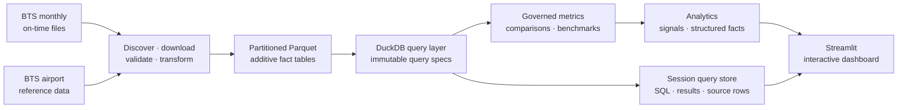
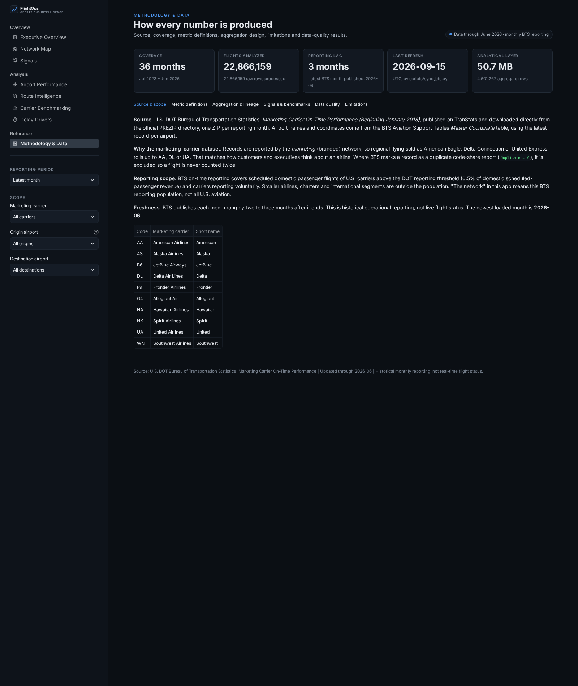

# FlightOps Intelligence


[](https://github.com/jameskbb/airline-ops/actions/workflows/ci.yml)
[](https://www.python.org/)
[](LICENSE)

FlightOps Intelligence is an open-source dashboard for understanding how the U.S. airline network is performing and
where operational friction is building. It turns official monthly on-time reporting into an explorable view of the
network, airports, routes, carriers and delay drivers.

The repository includes 36 months of processed data—22,866,159 flights from July 2023 through June 2026—so you can clone
it and start exploring immediately. No data download or API key is required.

[](docs/screenshots/overview.png)

> [!NOTE]
> FlightOps analyzes historical BTS reporting. It is not a live flight tracker, disruption-management system or
> prediction service.


## Why FlightOps exists

Public airline-performance data is rich, but it is not ready-made operational intelligence. A typical month contains
roughly 650,000 rows and 120 columns. The useful questions sit several transformations away from the source files:

- Was the network genuinely worse, or did traffic mix change?
- Is an airport struggling relative to similar hubs or only relative to the national average?
- Is a route unreliable for its distance and volume, or merely small and noisy?
- Which changes are unusual enough—and affect enough flights—to deserve attention?
- Are delays concentrated in a station, time of day, carrier or reported cause?

Straight averages and league tables answer these questions badly. They can average rates across incompatible groups,
double-count code-share records, reward tiny samples, confuse percentage changes with percentage-point changes, or
present weather-correlated disruption as if it proved causation.

FlightOps builds the analytical layer those questions need. It standardizes the source, stores additive facts at the
right grains, defines each metric once, compares like with like, and turns the result into an interface where a user can
move from a network pattern to the operating detail behind it.

### What the project provides

- **An operating picture, not a scorecard dump.** Network health, trends, hotspots and a concise operations brief lead
  with what changed and where to look next.
- **Purpose-built views at several levels.** Explore the network, an airport, a directional route, a carrier or the mix
  of reported delay causes without changing analytical conventions between pages.
- **Signals with materiality and scale.** Changes must clear magnitude, variability and volume rules; results are ranked
  by estimated affected flights.
- **A reproducible local analytical stack.** The source pipeline, data-quality reports, Parquet facts, DuckDB queries,
  metric layer and dashboard all live in this repository.
- **Clear boundaries.** Coverage, reporting lag, peer definitions, source limitations and data-quality checks are
  visible instead of buried in footnotes.


## What you can explore

### Start with the network

The **Executive Overview** summarizes the selected period with reliability, cancellation, severe-delay and delay-minute
measures; prior-period and year-over-year movement; network trends; operational hotspots; delay-cause mix; and a carrier
snapshot.

The **Network Map** shows where friction sits geographically. Airports are sized by departures and colored relative to
the network value. Focus an airport to see its busiest routes, or use the airport-by-hour heatmap to see when the
operating day deteriorates.

### Find changes worth investigating

The **Signals** feed looks for material and statistically unusual shifts in on-time performance, cancellations, severe
delays, taxi-out time, delay concentration and cause mix. Network-relative rules keep a system-wide disruption from
flagging every airport simply because the whole system moved.

Every signal states the entity, direction, magnitude, comparison window, estimated impact and why it was surfaced.

### Zoom into an operation

- **Airport Performance** profiles a station by month, hour, weekday, delay cause, carrier and problem route, with a
  percentile against airports in the same hub tier.
- **Route Intelligence** examines a directional market by carrier, departure hour and day of week, including block time
  versus actual time and reliability against routes in the same distance band.
- **Carrier Benchmarking** compares marketing carriers across reliability and cancellation, multi-period trends and a
  direction-aware strengths matrix where the visual meaning of “better” stays consistent.
- **Delay Drivers** breaks reported cause minutes down over time, by carrier, airport and hour, and includes a Delay
  Propagation Index for delay associated with late-arriving aircraft.

| Network and signals | Airport and route detail |
| --- | --- |
| [](docs/screenshots/network-map.png) | [](docs/screenshots/airports.png) |
| [](docs/screenshots/signals.png) | [](docs/screenshots/routes.png) |

## How it works



The pipeline creates four purpose-specific fact tables instead of one giant dashboard extract:

- `fact_route_monthly` supports the broadest filter combinations.
- `fact_origin_daily` preserves day-of-week patterns.
- `fact_origin_hourly` preserves station-by-hour behavior.
- `fact_route_profile` preserves route performance by carrier, hour and weekday.

Each month is an independent Parquet partition. Refreshes can replace one month without rebuilding everything, prune
months outside the rolling window, and reconcile flight counts across every fact table before the result is accepted.

<details>
<summary><strong>Repository map</strong></summary>

| Path | Responsibility |
| --- | --- |
| `app.py` | Streamlit entrypoint, navigation and global filters. |
| `src/flightops/data/` | Source discovery, schema contract, transforms, reconciliation, query specs and DuckDB store. |
| `src/flightops/metrics/` | Canonical metric definitions, direction-aware comparisons and period logic. |
| `src/flightops/analytics/` | Peer benchmarks, percentiles, hotspots, signals and structured facts. |
| `src/flightops/narrative/` | Deterministic operations brief and optional constrained LLM narrator. |
| `src/flightops/charts/` | Shared visual tokens, Plotly builders and PyDeck maps. |
| `src/flightops/ui/` | Filters, caching, components, navigation and the session query store. |
| `src/flightops/pages/` | One module per dashboard page. |
| `scripts/sync_bts.py` | Idempotent data refresh CLI. |
| `data/processed/` | Committed Parquet analytical layer. |
| `data/metadata/` | Coverage metadata and per-month data-quality reports. |

</details>


## Analytical approach

FlightOps is opinionated about the easy ways operational analysis goes wrong:

- **Store facts, derive rates.** Fact tables hold additive counts and minute sums. Rates are calculated only after the
  selected slice is aggregated, so the app never averages averages.
- **Define a metric once.** Labels, formulas, formats, direction and comparison behavior live in the metric layer rather
  than being reimplemented page by page.
- **Use honest denominators.** For example, on-time arrival excludes cancelled and diverted flights, while the
  Operational Reliability Score counts cancellations against the airline.
- **Compare appropriate peers.** Airports are grouped by hub tier. Directional routes are compared within distance bands
  and must clear a monthly volume floor.
- **Separate magnitude, unusualness and impact.** A signal must be large enough, unusual relative to the entity's own
  history, and operationally meaningful in affected flights.
- **Keep narrative downstream of facts.** The default operations brief is deterministic. An optional LLM narrator can
  only restate an approved facts object, and output containing an unknown number is discarded.
- **Make evidence inspectable.** Metric help shows the definition and inputs. The Data Explorer can show the exact query,
  result and stored rows, but traceability supports the analysis—it is not the product's only purpose.

<details>
<summary><strong>Core metric definitions</strong></summary>

| Metric | Definition |
| --- | --- |
| On-Time Arrival | Completed, non-diverted flights arriving under 15 minutes late ÷ completed arrivals. |
| Cancellation / Diversion Rate | Cancelled or diverted flights ÷ scheduled flights. |
| Completion Rate | (Scheduled − cancelled) ÷ scheduled; diversions count as operated. |
| Severe Delay Rate | Arrivals 60+ minutes late ÷ completed arrivals. |
| Avg Positive Arrival Delay | Mean `ArrDelayMinutes`, where early arrivals equal zero. |
| Total Delay Minutes | Sum of the five cause fields BTS reports for flights arriving at least 15 minutes late. |
| Delay Minutes per 100 Flights | Total reported delay minutes ÷ scheduled flights × 100. |
| Delay Propagation Index | Late-aircraft minutes ÷ total reported delay minutes. It does not reconstruct rotations. |
| Operational Reliability Score | On-time arrivals ÷ scheduled flights × 100. |

</details>

<details>
<summary><strong>Benchmarks and signal rules</strong></summary>

Airports are compared within FAA-style hub tiers (at least 1%, 0.25% or 0.05% of departures). Routes are compared with
directional routes in the same distance band that operate at least 90 flights a month. Hotspots rank excess delayed
arrivals: delayed flights beyond what the network delay rate implies for that volume.

Signals compare each entity's gap to the network with its trailing three-month gap. A shift must be material, unusual
against the entity's own month-to-month variability and above a volume floor. Severity combines estimated affected
flights with unusualness. The executable rules live in `src/flightops/analytics/signals.py`.

</details>

## Data and limitations

### Sources and coverage

- **Flights:** U.S. DOT Bureau of Transportation Statistics, *Marketing Carrier On-Time Performance (Beginning January
  2018)*, downloaded from the TranStats PREZIP directory.
- **Airports:** BTS Aviation Support Tables, *Master Coordinate*, using the latest record for each airport.
- **Included:** July 2023 through June 2026; 36 months; 22,866,159 flights; 370 airports; 8–10 marketing carriers,
  depending on month.
- **Distribution:** About 51 MB of zstd-compressed Parquet is committed to the repository. The lowest stored grain is
  day × marketing carrier × origin; individual flight records are not distributed.

BTS data is a public-domain work of the U.S. Government.

### Interpret with care

- Monthly reporting usually lags operations by two to three months.
- Delay causes are reported by carriers under DOT guidance. They describe attribution, not proven causation, and
  reporting practices can differ by carrier.
- BTS uses **Weather** for extreme weather; routine weather effects are generally reported under NAS.
- The Delay Propagation Index uses the reported late-aircraft cause. It does not follow individual aircraft rotations.
- Hourly analysis uses the scheduled local departure hour at the origin.
- Results cover reporting carriers. Marketing-carrier rankings differ from DOT operating-carrier rankings.
- Regional flights sold as American Eagle, Delta Connection or United Express roll up to the marketing brand. Records
  BTS identifies as duplicate code-share reports are excluded.


## Run it locally

Requires Python 3.11 or newer.

```bash
git clone https://github.com/jameskbb/airline-ops.git
cd airline-ops
python -m venv .venv
source .venv/bin/activate
python -m pip install -e .
streamlit run app.py
```

Open the local URL printed by Streamlit. The committed analytical layer is ready to query immediately.

### Optional LLM narration

The operations brief uses deterministic rules by default. To enable the optional Anthropic narrator:

```bash
python -m pip install -e ".[llm]"
export FLIGHTOPS_BRIEF_PROVIDER=anthropic
export ANTHROPIC_API_KEY=your-key
streamlit run app.py
```

The model receives calculated facts and may phrase them; it does not calculate metrics.

## Refresh the data

```bash
# Latest 36 published months
python scripts/sync_bts.py --months 36

# Explicit window
python scripts/sync_bts.py --start 2024-01 --end 2026-06

# Reprocess loaded months, keep older partitions and remove downloaded ZIPs
python scripts/sync_bts.py --months 36 --force --no-prune --purge-raw
```

The sync discovers published months, downloads only what it needs into gitignored `data/raw/`, validates the source
schema, transforms each month and reconciles every fact table. A full 36-month rebuild takes under a minute once the
source ZIPs are cached.

The [refresh workflow](.github/workflows/refresh-data.yml) runs weekly and on demand. It commits only when BTS has
published a new month.

## Develop and contribute

```bash
python -m pip install -e ".[dev]"
python -m ruff check src tests scripts app.py
python -m pytest -q
python -c "from flightops.data.pipeline import reconcile; print(len(reconcile()), 'months reconciled')"
```

The test suite covers query construction, metric behavior, comparison direction, page rendering, filter combinations,
route identity, schema validation, idempotent refreshes, reconciliation, signal thresholds and deterministic narrative.
It uses synthetic source data where needed and does not download BTS files.

Issues and pull requests are welcome. Changes to analytical behavior should keep definitions centralized, preserve
additive fact-table contracts, document new assumptions and include tests for denominator and edge-case behavior.

## More screenshots

| | |
| --- | --- |
| [](docs/screenshots/carriers.png) | [](docs/screenshots/delay-drivers.png) |
| [](docs/screenshots/metric-help.png) | [](docs/screenshots/data-explorer.png) |
| [](docs/screenshots/methodology.png) | |

## Technology

Python, Streamlit, DuckDB, Parquet, pandas, Plotly, PyDeck, pytest, Ruff and GitHub Actions.

## License

[MIT](LICENSE) for the code. BTS data is in the public domain.
