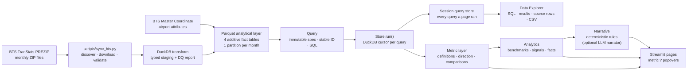

# FlightOps Intelligence


Turn official U.S. on-time data into a clear view of network reliability, airport friction, route health, carrier
performance and delay propagation. FlightOps Intelligence ships with **36 months and 22.9 million flights** already
processed, so the dashboard works from the first clone.

[](docs/screenshots/overview.png)

The app is built for questions that need defensible answers:

- **See what changed.** Compare the selected period with both the preceding period and the same period last year.
- **Find where it matters.** Rank unusual changes by estimated affected flights instead of surfacing every fluctuation.
- **Compare like with like.** Benchmark airports within hub tiers and routes within documented distance and volume peers.
- **Trace the answer.** Open the definition, inputs, exact SQL, result and stored source rows behind any aggregate.
- **Know the limits.** Coverage, reporting lag, lineage, data-quality checks and methodology stay visible in the product.

This is historical monthly reporting from the U.S. Bureau of Transportation Statistics (BTS), not live flight status.
The app reads its coverage from the loaded data and shows it on every page.


## Questions it answers

| Page | Use it to answer |
| --- | --- |
| **Executive Overview** | How healthy was the network, what changed, and where is operational friction concentrated? |
| **Network Map** | Where is friction geographically, and at what departure hours does it build? |
| **Signals** | Which changes are material, unusual and large enough to matter operationally? |
| **Airport Performance** | How is a station performing against similar hubs, by month, hour, weekday, carrier and route? |
| **Route Intelligence** | How reliable is a directional route against comparable routes, and when does it break down? |
| **Carrier Benchmarking** | How do carriers compare on reliability, cancellation, trend and relative strengths? |
| **Delay Drivers** | Which reported causes dominate, and how much delay is associated with late-arriving aircraft? |
| **Data Explorer** | What query produced a number, which stored rows fed it, and can I export them? |
| **Methodology** | How are metrics, grains, peer groups, limitations and data-quality checks defined? |

The global period, marketing-carrier, origin and destination filters stay consistent across the dashboard. The latest
period also produces a deterministic operations brief: rules choose statements from calculated facts, so narrative
never invents a number.


## Trust every number

Every KPI card and chart section has a **?** control:

1. Open it to see the metric definition, calculation, current-period inputs, comparison inputs and exact SQL.
2. Select **Open in Data Explorer** to jump to that query's result and the stored rows it aggregated.
3. Inspect filters and unapplied dimensions, then export either the result or source rows as CSV.

The query store is session-local and records every query run by the pages you visit, including filter options, signals
and operations-brief inputs. The SQL shown is the SQL executed.

### Why the comparisons hold up

- Rates are derived after aggregation from additive counts and minute sums; the app never averages averages.
- Rate changes are shown in percentage points, with separate prior-period and year-over-year comparisons.
- Marketing-carrier rollups include regional flying under the customer-facing brand and exclude BTS duplicate code-share
  records.
- Airport peers use FAA-style hub tiers. Route peers use the same distance band and require at least 90 flights a month.
- Signals compare each entity's network-relative gap with its trailing three-month gap, then apply materiality,
  unusualness and volume thresholds.


## How it fits together



| Path | Responsibility |
| --- | --- |
| `app.py` | Page configuration, navigation and global filters. |
| `src/flightops/data/` | Source discovery, schema contract, transformation, reconciliation, query specs and DuckDB execution. |
| `src/flightops/metrics/` | Canonical KPI definitions, direction-aware comparisons and period logic. |
| `src/flightops/analytics/` | Peer benchmarks, percentiles, hotspots, signals and structured facts. |
| `src/flightops/narrative/` | Deterministic brief rules and the optional constrained LLM narrator. |
| `src/flightops/charts/` | Shared design tokens, Plotly builders and PyDeck maps. |
| `src/flightops/ui/` | Caching, filters, components, navigation and the session query store. |
| `src/flightops/pages/` | One module per dashboard page, including the Data Explorer. |
| `scripts/sync_bts.py` | Idempotent data-discovery, download and processing CLI. |
| `data/processed/` | Committed Parquet facts: about 51 MB for 36 months. |
| `data/metadata/` | Coverage metadata and per-month data-quality reports. |

### Engineering choices

- **Marketing-carrier dataset.** Regional flying sold as American Eagle, Delta Connection or United Express rolls up to
  the brand, which matches how customers and executives think about an airline. Records BTS flags as duplicate code-share
  reports are excluded so a flight is never counted twice.
- **Additive facts only.** Fact tables store counts and minute sums, never rates. Every KPI is derived after aggregation,
  so any slice re-derives correctly instead of averaging averages.
- **Grain chosen per question.** `fact_route_monthly` (month × carrier × origin × destination) answers every KPI and
  filter combination. Daily, hourly and route-profile tables exist only where a question needs that grain. That keeps
  36 months of history to about 51 MB of Parquet, small enough to commit so the app works on first clone.
- **Month-granular periods.** BTS publishes monthly, so analytical periods are whole months, compared with the preceding
  equal-length period and the same months a year earlier.
- **Idempotent refresh.** Each month is its own Parquet partition per table. Re-running a month replaces exactly that
  month, months outside the window are pruned, and every sync reconciles flight counts across all fact tables against
  the month's data-quality report. A mismatch fails the run.
- **Every read is a `Query`.** A frozen spec (table, month window, filters, group-by) with a stable ID. The SQL shown in
  the app is the SQL that runs. Filters a table cannot honor are recorded as *not applied* and shown, never dropped
  silently. Results are cached with `st.cache_data`; the DuckDB store is a single `st.cache_resource` that opens a
  cursor per query. Pages record each query in the session's query store, which the Data Explorer reads.
- **Numbers before narrative.** The *Latest Operations Brief* is generated by rules from structured facts. An optional
  LLM can narrate only those facts; output containing an unapproved figure is discarded.

## Analytics methodology

| Metric | Definition |
|---|---|
| On-Time Arrival | Completed, non-diverted flights arriving < 15 minutes late (DOT convention) ÷ completed arrivals. Cancelled and diverted flights are excluded. |
| Cancellation / Diversion Rate | Cancelled (diverted) ÷ scheduled flights |
| Completion Rate | (Scheduled − cancelled) ÷ scheduled; diversions count as operated |
| Severe Delay Rate | Arrivals 60+ minutes late ÷ completed arrivals |
| Avg Positive Arrival Delay | Mean `ArrDelayMinutes` (early = 0). Shown separately from **schedule variance** (mean signed `ArrDelay`) |
| Total Delay Minutes | Sum of the five reported cause fields, which BTS populates for 15+ minute arrival delays |
| Delay Minutes per 100 Flights | Total delay minutes ÷ scheduled × 100, for size-neutral comparison |
| Delay Propagation Index | Late-aircraft minutes ÷ total delay minutes. It measures delay *associated with* inbound aircraft arriving late and does not reconstruct rotations. |
| Operational Reliability Score | On-time arrivals ÷ scheduled flights × 100. Cancellations count against it, so an airline cannot raise it by cancelling late-running flights. |

**Benchmarks.** Airports are compared within FAA-style hub tiers (≥1%, ≥0.25%, ≥0.05% of departures). Routes are compared
with directional routes in the same distance band that fly at least 90 flights a month. Hotspots rank *excess delayed
arrivals*: delayed flights beyond what the network delay rate implies for that volume.

**Signals.** Each entity's gap to the network is compared with its trailing three-month gap. A shift must be material (for
example ≥4 pts on-time), unusual (|z| ≥ 2 against the entity's own month-to-month variability) and above a volume floor.
Because the test is network-relative, a system-wide thunderstorm month doesn't flag every airport. Severity combines
scale (affected flights per month) with unusualness. The full rules are on the Signals page and in
`src/flightops/analytics/signals.py`.

## Data

- **Primary:** U.S. DOT Bureau of Transportation Statistics, *Marketing Carrier On-Time Performance (Beginning January
  2018)*, downloaded directly from the TranStats PREZIP directory (`https://transtats.bts.gov/PREZIP/`).
- **Airports:** BTS Aviation Support Tables, *Master Coordinate*, using the latest record per airport.
- **Included now:** July 2023 – June 2026 (36 months), 22,866,159 flights, 370 airports, 8–10 marketing carriers
  depending on month.

BTS data is a public-domain work of the U.S. Government. The committed analytical layer contains aggregates rather than
individual flight records; its lowest grain is day × marketing carrier × origin.


## Run it yourself

```bash
git clone https://github.com/jameskbb/airline-ops.git
cd airline-ops
python -m venv .venv && source .venv/bin/activate
pip install -e ".[dev]"
streamlit run app.py
```

Open the local URL printed by Streamlit. The processed dataset is committed, so startup needs no BTS download and no API
key.

## Updating data

```bash
# Rolling window of the latest 36 published months (default)
python scripts/sync_bts.py --months 36

# Explicit window
python scripts/sync_bts.py --start 2024-01 --end 2026-06

# Reprocess months already loaded, keep months outside the window, drop raw ZIPs after use
python scripts/sync_bts.py --months 36 --force --no-prune --purge-raw
```

The sync lists what BTS has published, downloads only missing months into `data/raw/` (gitignored), validates the source
schema and fails with the exact missing columns if BTS changes it. It then writes monthly partitions, prunes months
outside the window, reconciles every fact table, rebuilds the airport dimension and writes `data/metadata/`. A full
36-month build takes under a minute once the raw files are cached.

**Automated refresh.** `.github/workflows/refresh-data.yml` runs weekly and on demand, because BTS publishes on no fixed
day. It runs the same idempotent sync, validates with the test suite and commits only when a new month arrived. Each
refresh adds roughly 1.4 MB of Parquet. If repository growth ever matters, the same workflow can publish
`data/processed` as a release asset and have the app download it at startup; the store reads from any directory set
by `FLIGHTOPS_DATA_DIR`.

**Optional LLM brief.** Install `.[llm]` and set `FLIGHTOPS_BRIEF_PROVIDER=anthropic` and `ANTHROPIC_API_KEY`, as
environment variables or Streamlit secrets. Without them, the deterministic brief is used.

## Develop

```bash
python -m pytest -q
python -m ruff check src tests scripts app.py
```

Nothing in the test suite downloads BTS data. It covers:
- query building, IDs, parameterized SQL and not-applied filters
- every page rendering through Streamlit's `AppTest`, unfiltered and under filter combinations, and pages recording
  their queries in the query store
- the metric definitions and their null and zero-denominator handling
- cancelled and diverted flight treatment
- cause aggregation and reconciliation
- direction-aware comparisons
- directional and undirected route identifiers
- month filtering
- schema validation against a synthetic BTS file that includes the real source's quirks
- idempotent reprocessing and sync planning
- signal thresholds, network-relative behavior and minimum-volume rules
- the deterministic brief

CI (`.github/workflows/ci.yml`) runs lint, tests and a reconciliation check of the committed data.

### Technology

Python 3.11+, Streamlit (`st.navigation` / `st.Page`), DuckDB, Parquet (zstd), pandas, Plotly, PyDeck with CARTO
basemaps, pytest, ruff and GitHub Actions.

## Limitations

- Monthly reporting lags two to three months; this is not real-time data.
- Delay causes are *reported* by carriers under DOT guidance. They describe attribution, not causation, and attribution
  practices vary by carrier.
- The Weather cause covers extreme weather only. Routine weather effects are reported under NAS.
- Propagation uses the reported late-aircraft cause and does not trace individual aircraft.
- Hourly views use the *scheduled* local departure hour at the origin.
- The population is reporting carriers only. Marketing-carrier rankings differ from DOT's operating-carrier rankings.
- The app ships aggregated tables (lowest grain: day × carrier × origin), not individual flight records. The sync
  script rebuilds everything from the BTS source files.

## Screenshots

| | |
|---|---|
|  |  |
|  |  |
|  |  |
|  |  |
|  | |

## License

MIT for the code. BTS data is in the public domain.
